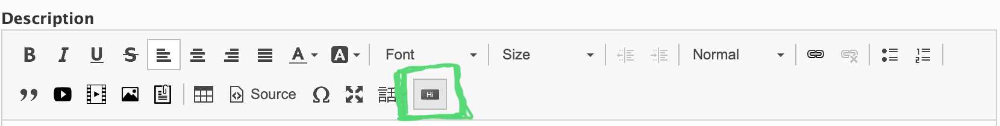
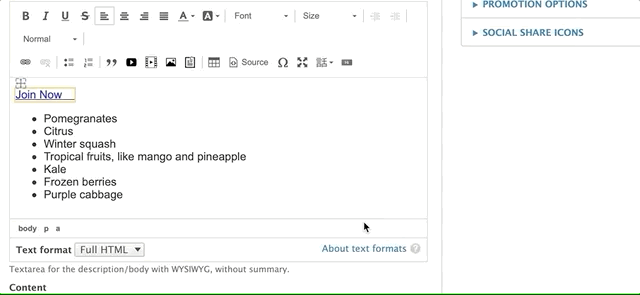
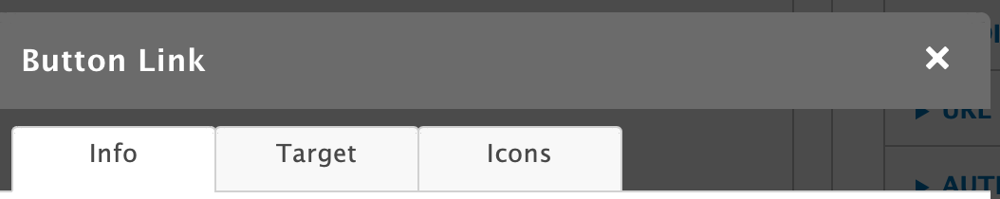
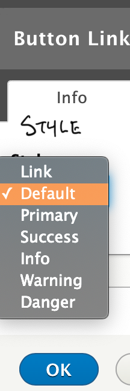
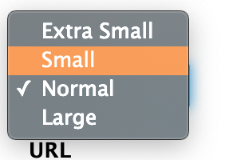
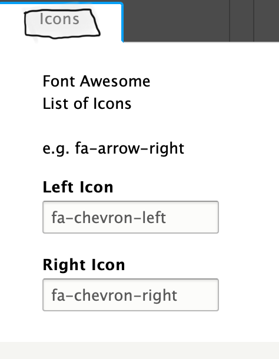

```markdown
---
title: 'Building Buttons'
weight: 1
---


This document applies to the legacy WYSIWYG editor, CKEditor 4. See the [Using Button Classes](../adding-links#using-button-classes) for updated instructions on creating buttons using CSS classes in the current editor.


As an alternative to using the link tool, you can create buttons with YMCA Website Services using the button editor in CKEditor 4. When you click the button icon, a pop-up window will appear.



> You can also edit a button you've created previously by clicking on the link within the text editor.



The button editor has three tabs: **Info**, **Target**, and **Icons**.



---

## Info Tab

This tab provides basic styling options for your button or link. The **Style Option** dropdown menu in the top-left corner allows you to style your button or output it as a plain link.

*   **Link:** Embeds your link text inline within a paragraph.
*   **Button Styles:** The appearance of the button styles depends on your website's theme:
    *   **Lily:** All button styles other than "Link" default to purple.
    *   **Rose:** All options except "Default" will output a blue button. "Default" outputs a white button.
    *   **Carnation:** The button options all output different colors.

### Button Style Guide Example:

> @mlefler From the YMCA of Lincoln, NE, [built this guide to provide examples](https://www.ymcalincoln.org/buttons) of possible styles for buttons. Consult your developer or designer for a style guide specific to your YMCA website.

The **Size** dropdown menu in the top-right corner offers four options for your button size. If you select the "Link" style option, the Size option will not affect your link's appearance.




Add the text for your link/button in the bottom-left **Text** field. Enter the destination URL in the **URL** field on the bottom right.

*   **Internal Links (links within your website):** Use a relative path, starting with a `/` after your domain.
    *   For example, to link to `example.org/about`, enter `/about`. This is called a relative path and helps with analytics tracking.
*   **External Links (links to other websites):** Use the full URL, including `https://`.
    *   For example, to link to `example.org/about`, enter `https://example.org/about`.
*   **Email Links:** Use the `mailto:` prefix followed by the email address.
    *   For example: `mailto:example@exampleymca.org`.

[Learn more about absolute vs. relative links](https://www.coffeecup.com/help/articles/absolute-vs-relative-pathslinks/).

---

## Target Tab

This tab allows you to control the link's behavior when clicked. By default, all links have a "Not Set" behavior, which means the link opens in the same tab. The other options include:

*   **Frame**
*   **Popup**
*   **New Window (_blank)**
*   **Topmost Window (_top)**
*   **Same Window (_self)**
*   **Parent Window (_parent)**

**[» Learn more about link targets](http://www.tagindex.net/html/frame/a_target.html)**

---

## Icons Tab



You can add icons to your buttons or links using the **Icons** tab. Use the **Left Icon** and **Right Icon** text fields to integrate icons from the Font Awesome library.

*Example:* To display a right-facing chevron, type `fa-chevron-right` in the **Right Icon** text field.

**Browse free Font Awesome icons at [fontawesome.com](https://fontawesome.com/v5/search?m=free)**

> **Note:** The left fields reference the Bootstrap Glyphicons library. This icon library has been deprecated, and the Glyphicons fields will not function correctly in YMCA Website Services. These fields will be removed once the code is updated by the tool's maintainer.
```